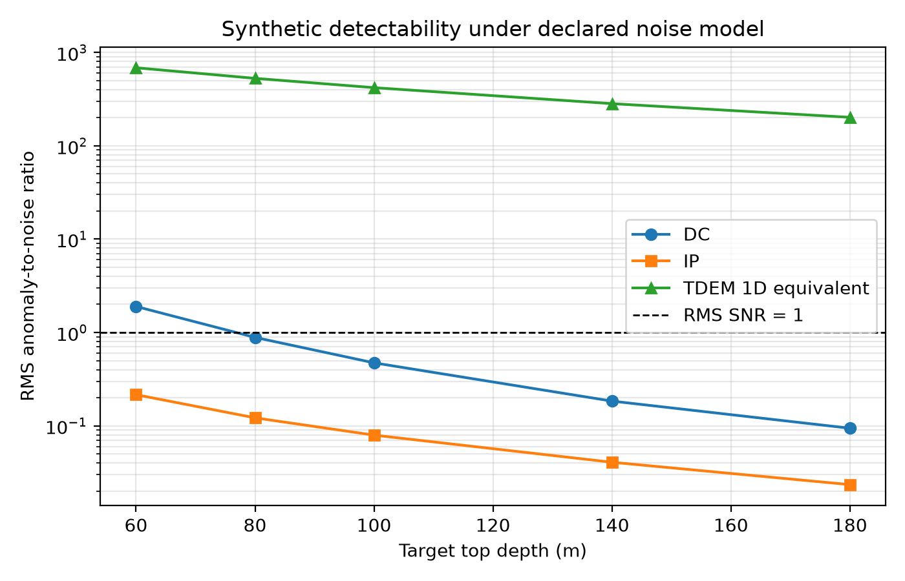
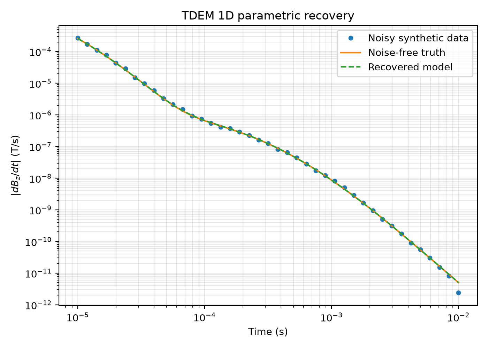

---
# Метаданные находятся в metadata.yaml.
# Сборка:
# pandoc -s report.md --metadata-file=metadata.yaml -o report.pdf \
#   --pdf-engine=xelatex --lua-filter=include-files.lua
---

# Введение

```{.include shift-heading-level-by=1}
docs/SCIENTIFIC_SCOPE.md
```

# Глава 1. Геологическая и геоэлектрическая модель

```{.include shift-heading-level-by=1}
models/geological_model.md
models/model_parameters.md
```

# Глава 2. Методы

```{.include shift-heading-level-by=1}
methods/dc_method.md
methods/ip_method.md
methods/tdem_method.md
```

# Глава 3. Численное моделирование

```{.include shift-heading-level-by=1}
modeling/numerical_modeling.md
```

# Глава 4. Результаты и обсуждение

```{.include shift-heading-level-by=1}
docs/RESULTS.md
```

{ width=90% }

{ width=80% }

{ width=80% }

{ width=80% }

{ width=80% }

# Заключение

Поставленная задача решена на уровне контролируемых синтетических сценариев.
Показано, что корректное сгущение сетки необходимо для устойчивого IP отклика,
а сетка 5 м согласуется с результатом 2,5 м в пределах 1 %. Для эталонной цели
на глубине 100 м выбранная DC/IP установка не обеспечивает среднее отношение
аномалия/шум выше единицы, поэтому однозначная оценка глубины и ширины
невозможна. TDEM 1D позволяет восстановить параметры эквивалентного слоя, но
не конечного тела. Главная практическая рекомендация — не переносить 1D TDEM
результат на рудное тело без 3D проверки и локальной петрофизики.

# Литература

```{.include shift-heading-level-by=1}
docs/REFERENCES.md
```
