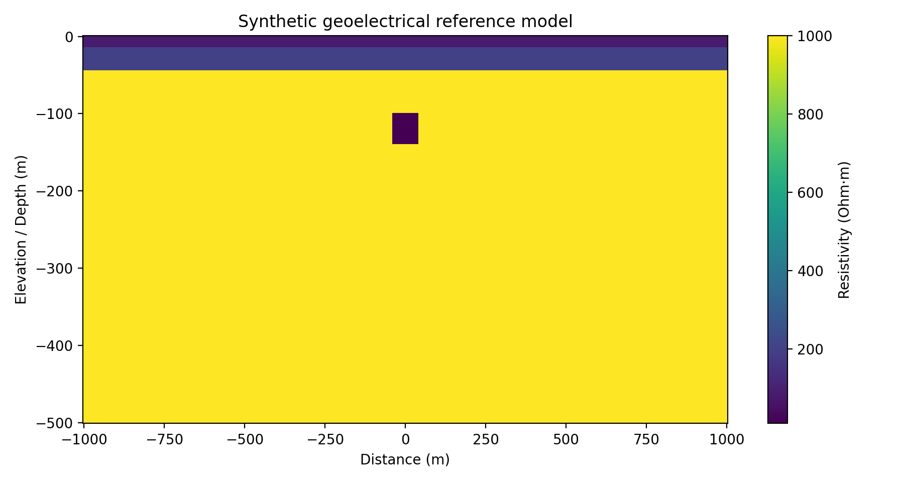
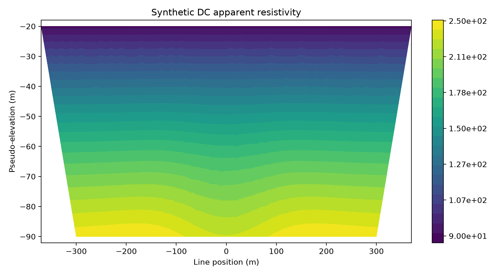
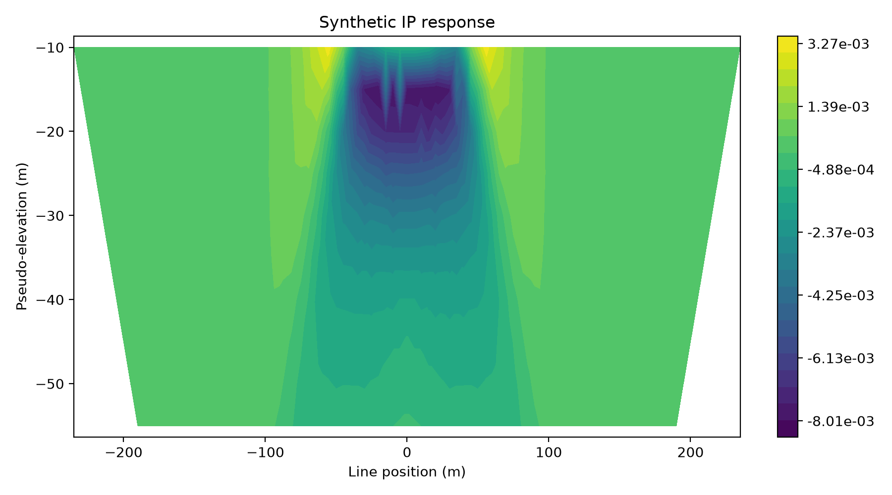
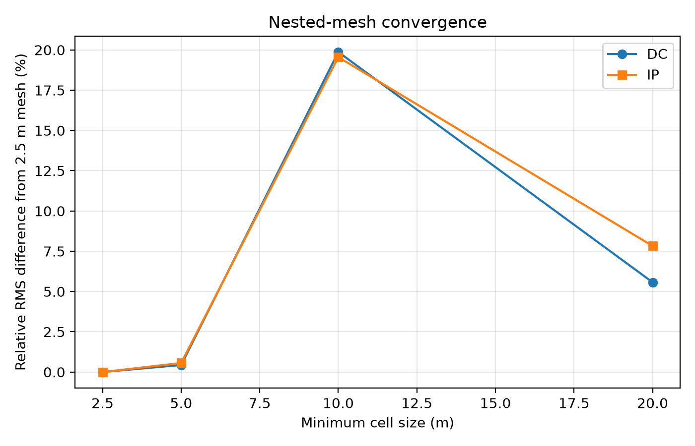
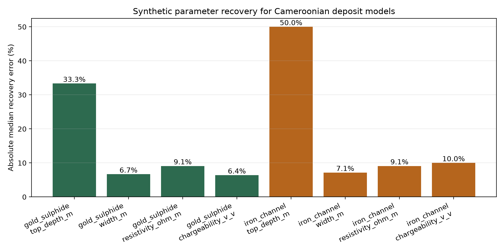
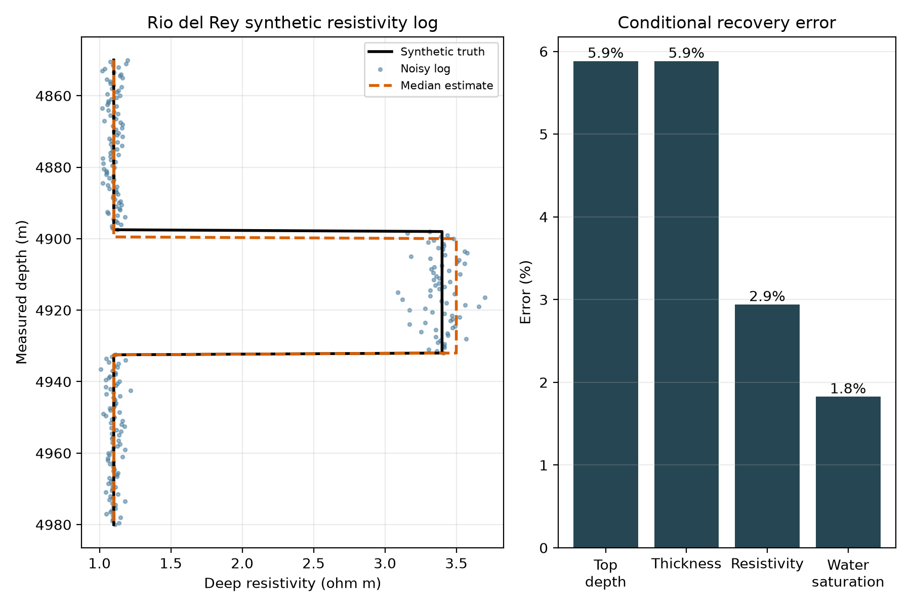

---
# Compilation :
# pandoc -s report_fr.md --metadata-file=metadata_fr.yaml \
#   -o output/pdf/memoire_corrige_francais.pdf --pdf-engine=xelatex
---

# Introduction et problématique scientifique

## Objet de l'étude et question principale

Ce mémoire étudie le potentiel de méthodes géoélectriques accessibles pour
estimer les paramètres de modèles géologiques typiques des gisements
camerounais à partir de données synthétiques. Il ne cherche donc ni à modifier
la nature du sujet, ni à démontrer simplement qu'une cible est « détectable ».
L'objectif central est de quantifier la capacité des méthodes retenues à
restituer des paramètres géométriques et électriques représentatifs.

La question scientifique principale est la suivante : **avec quelle précision
les méthodes géoélectriques choisies en fonction de la profondeur et de la
géométrie des cibles permettent-elles de retrouver les paramètres de modèles
construits à partir de résultats camerounais publiés ?** L'étude principale
porte sur DC/ERT et IP pour les modèles miniers. Un troisième axe examine, comme
cas particulier, un réservoir pétrolier et gazier profond par diagraphie de
résistivité.

Le choix de DC/ERT et IP repose sur deux considérations. Premièrement, ces
méthodes sont disponibles dans SimPEG et peuvent être mises en oeuvre dans une
géométrie 2D cohérente. Deuxièmement, plusieurs études camerounaises fournissent
des intervalles de résistivité, de chargeabilité et de profondeur qui rendent
possible une confrontation raisonnée entre l'expérience synthétique et les
observations de terrain antérieures.

## Logique de démonstration

La démarche suivie peut être résumée ainsi :

```text
Publications de terrain -> intervalles de paramètres -> modèle synthétique vrai
-> modélisation directe -> ajout de bruit -> estimation des paramètres
-> erreur de restitution -> comparaison aux intervalles de terrain
```

Les valeurs issues du terrain ne sont pas remplacées par les valeurs
synthétiques. Elles remplissent deux fonctions distinctes :

1. contraindre le choix de modèles initiaux géologiquement plausibles ;
2. constituer des intervalles indépendants auxquels les paramètres estimés
   sont ensuite comparés.

## Hypothèses de travail

1. L'utilisation conjointe des réponses DC et IP contraint mieux les paramètres
   du modèle que l'interprétation d'une seule propriété physique.
2. La résistivité et la chargeabilité de la cible peuvent être estimées plus
   précisément que sa profondeur, les paramètres géométriques étant davantage
   affectés par les phénomènes d'équivalence.
3. Le profil d'altération tropicale influence la réponse du corps minéralisé et
   doit être explicitement intégré au modèle direct.
4. La concordance entre les estimations synthétiques et les intervalles
   publiés à Bindiba, Yassa et Messondo indique l'applicabilité des méthodes aux
   types de modèles considérés. Elle ne constitue toutefois pas une preuve de
   la présence de minerai sur un nouveau site.
5. Pour un réservoir pétrolier et gazier profond, la diagraphie électrique peut
   estimer les limites, l'épaisseur et la résistivité de la formation, mais ne
   distingue pas à elle seule le pétrole du gaz.

## Définitions opérationnelles

- **Paramètre vrai** : valeur imposée au modèle synthétique générateur des
  données.
- **Paramètre estimé** : valeur de la grille de recherche minimisant l'écart
  quadratique moyen normalisé entre les observations synthétiques bruitées et
  la bibliothèque de réponses.
- **Erreur de restitution** :
  `(estimation - valeur vraie) / valeur vraie × 100 %`.
- **Concordance avec le terrain** : appartenance de l'estimation à un intervalle
  publié ou satisfaction d'un critère de seuil documenté.
- **Sensibilité** : variation RMS relative de la réponse synthétique lorsqu'un
  seul paramètre du modèle est modifié.

## Limites du travail

La réalisation principale porte sur DC/ERT et IP en 2D. Le TDEM n'est pas
inclus dans la démonstration centrale, car la formulation 1D stratifiée
disponible ne permet ni d'estimer la largeur d'un corps fini, ni de réaliser
une comparaison homogène avec les jeux de paramètres camerounais retenus. Il
reste une extension méthodologique possible.

Le cas pétrolier et gazier utilise une diagraphie synthétique de résistivité,
car les analogues publiés à Rio del Rey et Douala se trouvent en forage à des
profondeurs qui ne sont pas accessibles au dispositif DC/IP de surface retenu.
La saturation en eau est calculée conditionnellement par l'équation de
Simandoux, avec porosité, argilosité et résistivité de l'eau fixées.

L'estimation est **conditionnelle** : la géométrie, la résistivité et la
chargeabilité sont explorées par groupes, les autres paramètres étant fixés.
Cette stratégie constitue une expérience synthétique contrôlée. Elle ne doit
pas être présentée comme une inversion tomographique 2D entièrement libre.

# Chapitre 1. Revue de littérature et analogues de terrain

## Contexte géoélectrique camerounais

Robain et al. (1996) ont montré que la couverture d'altération tropicale au
Cameroun présente une stratification géoélectrique marquée. D'après leurs
sondages électriques verticaux, la résistivité des matériaux ferrugineux est
d'environ 2100 à 4200 Ohm·m, celle de la saprolite de 820 à 1600 Ohm·m, celle
de la saprolite saturée de 160 à 220 Ohm·m et celle du socle cristallin acide de
6100 à 8700 Ohm·m. Ces intervalles sont utilisés pour définir le fond des
modèles synthétiques.

À Yassa, la zone aurifère associée aux sulfures est caractérisée par une
chargeabilité élevée, supérieure ou égale à 30 mV/V, une résistivité faible
pouvant atteindre 60 Ohm·m pour l'extrémité la plus conductrice et un toit situé
à environ 13 m. À Bindiba, les anomalies potentiellement minéralisées se situent
principalement entre 10 et 20 m de profondeur ; la zone conductrice présente
une résistivité inférieure à 900 Ohm·m et une chargeabilité d'environ 30 à
67,1 mV/V. Ces résultats motivent le premier modèle synthétique.

À Messondo, les structures interprétées comme des canaux de minéralisation
ferrifère possèdent une résistivité comprise entre 510 et 3000 Ohm·m et une
chargeabilité supérieure à 16 mV/V. L'épaisseur de la couverture atteint 25 m,
tandis que la puissance des formations minéralisées est estimée entre 45 et
90 m, avec des valeurs pouvant dépasser 150 m. Ces observations définissent
l'échelle du second scénario.

## Cas particulier des bassins pétroliers et gaziers

Dans le champ M du bassin offshore de Douala, Chongwain et al. (2019) ont
délimité quatre réservoirs à hydrocarbures de 6,2 à 78,7 m d'épaisseur à partir
des diagraphies gamma ray, résistivité, neutron et densité. Les valeurs
publiées comprennent des porosités de 20,8 à 40,2 % et des saturations en
hydrocarbures de 69,2 à 81,7 %.

Dans le bassin de Rio del Rey, Domra Kana et al. (2021) ont décrit des
réservoirs gréseux présentant une porosité effective de 15 à 34 %, une
perméabilité de 29 à 278 mD et une saturation en eau de 3 à 63 %. Kissaaka et
al. (2021) ont identifié le réservoir argilo-gréseux R4 entre 4 898 et 4 932 m :
épaisseur de 34 m, résistivité d'environ 3,4 Ohm·m, porosité de 23 à 25 % et
volume d'argile d'environ 43 %. Ces valeurs définissent le troisième modèle.

Les études AMT du bassin de Mamfé montrent par ailleurs des formations
sédimentaires conductrices de 1 à 100 Ohm·m jusqu'à environ 1 km. Elles
démontrent l'intérêt de l'électromagnétisme pour l'architecture des bassins,
mais ne constituent pas une identification directe des fluides pétroliers.

## Portée méthodologique des travaux antérieurs

Les paramètres publiés se recouvrent entre plusieurs lithologies ; ils ne
constituent donc pas, pris isolément, des critères diagnostiques univoques de
minéralisation. La modélisation ne consiste pas à associer mécaniquement une
valeur électrique à une seule roche. Elle vise à déterminer si des méthodes
choisies selon la profondeur et la géométrie de la cible peuvent retrouver les
paramètres d'un modèle contrôlé avec une erreur quantifiable.

Les travaux consacrés à SimPEG justifient l'emploi d'une plateforme ouverte et
commune pour les problèmes directs et l'estimation paramétrique. Les études
camerounaises fournissent les plages de paramètres, motivent la géométrie des
scénarios et constituent une base externe de comparaison.

# Chapitre 2. Modèles géologiques

## Profil commun d'altération

Les deux modèles comprennent une surface plane, un horizon ferrugineux
superficiel composite de 5 m d'épaisseur, une saprolite de 20 m et un socle
cristallin acide. Les résistivités retenues sont respectivement de 3000,
1000 et 7400 Ohm·m. Elles se situent dans les intervalles décrits à Nko'ongop
par Robain et al. (1996).

## Modèle 1 : zone aurifère sulfurée

Un corps rectangulaire conducteur et polarisable représente une minéralisation
associée aux sulfures dans des zones fracturées et des veines de quartz. Ses
paramètres vrais sont : toit à 15 m, largeur de 75 m, hauteur de 30 m,
résistivité de 550 Ohm·m et chargeabilité de 0,047 V/V. Ce scénario est motivé
par les résultats de Bindiba et de Yassa.

## Modèle 2 : canal de minéralisation ferrifère

Le second modèle représente un canal plus large et plus puissant : toit à
10 m, largeur de 140 m, hauteur de 85 m, résistivité de 1650 Ohm·m et
chargeabilité de 0,020 V/V. Ces valeurs appartiennent aux intervalles publiés
pour Messondo.

Les deux géométries sont des modèles 2D typifiés et non des reconstructions de
profils particuliers. Les corps sont supposés de longueur infinie dans la
direction perpendiculaire à la coupe.

## Modèle 3 : cas particulier d'un réservoir pétrolier et gazier

Le troisième modèle représente une diagraphie 1D du réservoir argilo-gréseux
R4 de type Rio del Rey. Le toit est fixé à 4 898 m, l'épaisseur à 34 m, la
résistivité de formation à 3,4 Ohm·m, la résistivité encaissante à 1,1 Ohm·m,
la porosité effective à 0,25 et le volume d'argile à 0,43. Contrairement aux
deux premiers scénarios, il s'agit d'une expérience de forage profonde et non
d'une acquisition de surface 2D.

Le modèle représente le contraste électrique d'un intervalle contenant des
hydrocarbures. Il ne définit pas deux classes électriques séparées pour le
pétrole et le gaz, car leur distinction par la seule résistivité est ambiguë.

## Paramètres et justification

| Composante | Paramètre | Valeur | Justification |
|---|---|---:|---|
| Horizon ferrugineux superficiel | épaisseur | 5 m | couverture typifiée de Nko'ongop |
|  | résistivité | 3000 Ohm·m | Robain et al. (1996) |
| Saprolite | épaisseur | 20 m | intervalle pouvant dépasser 50 m à Nko'ongop |
|  | résistivité | 1000 Ohm·m | Robain et al. (1996) |
| Socle | résistivité | 7400 Ohm·m | granulite acide R1, Robain et al. (1996) |
| Cible aurifère sulfurée | toit | 15 m | Bindiba/Yassa |
|  | largeur | 75 m | valeur de scénario |
|  | hauteur | 30 m | valeur de scénario |
|  | résistivité | 550 Ohm·m | domaine conducteur de Bindiba |
|  | chargeabilité | 0,047 V/V | 30-67,1 mV/V à Bindiba |
| Cible ferrifère | toit | 10 m | couverture de Messondo |
|  | largeur | 140 m | valeur de scénario |
|  | hauteur | 85 m | puissance publiée à Messondo |
|  | résistivité | 1650 Ohm·m | 510-3000 Ohm·m à Messondo |
|  | chargeabilité | 0,020 V/V | >16 mV/V à Messondo |
| Réservoir pétrolier/gazier R4 | toit | 4898 m | Kissaaka et al. (2021) |
|  | épaisseur | 34 m | Kissaaka et al. (2021) |
|  | résistivité | 3,4 Ohm·m | Kissaaka et al. (2021) |
|  | porosité effective | 0,25 | 0,23-0,25, Kissaaka et al. (2021) |
|  | volume d'argile | 0,43 | Kissaaka et al. (2021) |

Les dimensions qui ne sont pas fournies sous forme d'intervalles précis dans
les publications sont des valeurs de scénario choisies à l'intérieur des
échelles décrites. Leur statut est explicitement distingué de celui des
intervalles électriques mesurés. Les sources numériques lisibles par machine
sont `scripts/model_parameters.json`, `scripts/model_scenarios.json`,
`scripts/petroleum_scenario.json` et `data/field_benchmarks.csv`.

# Chapitre 3. Méthodes géoélectriques retenues

## Résistivité en courant continu

Le courant est injecté par les électrodes A et B, tandis que la différence de
potentiel est mesurée entre M et N. Après normalisation par l'intensité du
courant et le facteur géométrique, on calcule la résistivité apparente. Cette
grandeur est une fonction intégrale de la distribution de conductivité et de
la géométrie du dispositif ; elle n'est pas la résistivité vraie au point du
pseudosection.

Le dispositif dipôle-dipôle est déployé le long d'un profil allant de -250 à
250 m, avec un espacement d'électrodes de 10 m et dix dipôles récepteurs par
source. Le problème direct 2D est résolu dans SimPEG sur un maillage adaptatif
en volumes finis. L'hypothèse 2D correspond à un corps d'extension infinie
perpendiculairement au profil.

La réponse DC est utilisée principalement pour estimer la résistivité de la
cible. Combinée à IP, elle contribue également à contraindre la profondeur du
toit et la largeur.

## Polarisation provoquée

La polarisation provoquée caractérise la polarisation électrique
supplémentaire des roches lors du passage du courant. Le paramètre fondamental
du modèle est la chargeabilité sans dimension, exprimée en V/V. La géométrie
est identique à celle du calcul DC et la conductivité est fixée avant la
résolution du problème IP linéaire.

La chargeabilité de la cible aurifère sulfurée est fixée à 0,047 V/V et celle
de la cible ferrifère à 0,020 V/V, conformément aux domaines de Bindiba et de
Messondo. Le fond est supposé non polarisable dans le modèle de référence.

Cette simplification ne prend pas en compte la polarisation des argiles, la
dispersion spectrale, les paramètres de Cole-Cole ni la dépendance à la fenêtre
d'intégration. La chargeabilité obtenue doit ainsi être interprétée comme un
paramètre effectif et non comme une mesure directe de la teneur en sulfures.

## Cas particulier : diagraphie électrique du réservoir

Les réservoirs documentés de Rio del Rey et Douala se situent à des profondeurs
nettement supérieures à la profondeur d'investigation du dispositif DC/IP de
surface. Le troisième scénario utilise donc une diagraphie profonde de
résistivité, directement comparable aux études camerounaises disponibles.

La saturation en eau est calculée avec une forme simplifiée de l'équation de
Simandoux :

`1/Rt = phi^m Sw^2/(a Rw) + Vsh Sw/Rsh`.

Les paramètres sont `a = 1`, `m = n = 2`, `Rw = 0,045 Ohm·m` et
`Rsh = 1,2 Ohm·m`. La porosité, l'argilosité et la résistivité de l'eau de
formation sont fixées. La valeur de `Sw` reste donc conditionnelle à ces
hypothèses pétrophysiques. La distinction pétrole-gaz exigerait notamment les
diagraphies neutron-densité ou une analyse directe des fluides.

# Chapitre 4. Modélisation numérique et estimation paramétrique

## Problèmes directs

Les réponses DC et IP sont calculées avec SimPEG sur un maillage TreeMesh 2D
adaptatif. La surface correspond à `z = 0` et la profondeur est comptée
négativement. Le raffinement est appliqué près de la surface, des électrodes,
des contacts lithologiques et de toutes les positions possibles des cibles.

Pour DC, la propriété du modèle est la conductivité `sigma = 1/rho`, puis le
résultat est converti en résistivité apparente. Pour IP, la conductivité est
fixée à partir du modèle DC et la chargeabilité sans dimension constitue la
propriété variable. La discrétisation SimPEG/discretize repose sur la méthode
des volumes finis.

## Vérification de la convergence

Des maillages de cellules minimales 20, 10, 5 et 2,5 m sont construits sur le
même domaine. Les vecteurs de données sont comparés à la solution obtenue avec
la cellule de 2,5 m au moyen d'une norme RMS relative. Le maillage final de
2,5 m est retenu, car le maillage de 5 m présente encore un écart de 9,26 %
pour IP, contre 2,14 % pour DC.

Ce test vérifie la stabilité numérique des réponses par raffinement imbriqué.
Il ne quantifie pas à lui seul l'erreur de modélisation géologique, laquelle
dépend aussi de la paramétrisation choisie.

## Construction des observations synthétiques

Un bruit gaussien indépendant est ajouté aux données sans erreur. L'écart-type
de chaque observation est défini par

`sigma_i = sqrt((r |d_i|)^2 + f^2)`,

où `r` est l'erreur relative et `f` un seuil absolu. Les niveaux relatifs
adoptés sont de 3 % pour DC et 5 % pour IP. Les graines aléatoires sont fixées
afin d'assurer la reproductibilité des expériences.

## Procédure d'estimation conditionnelle

Une bibliothèque de réponses est calculée à l'avance pour chaque modèle. Le
couple géométrique, profondeur du toit et largeur, est choisi en minimisant une
fonction d'écart normalisée commune aux données DC et IP. La résistivité est
ensuite estimée à partir de DC et la chargeabilité à partir de IP. Chaque groupe
est exploré en maintenant les autres paramètres constants. L'expérience est
répétée pour vingt réalisations indépendantes du bruit.

Les valeurs vraies sont volontairement absentes des grilles de recherche. Ce
choix évite une restitution artificiellement exacte d'un noeud déjà présent et
permet d'évaluer la résolution effective de la paramétrisation. Le résultat
reste une estimation conditionnelle ; il ne correspond pas à une inversion
tomographique 2D libre de l'ensemble des cellules.

## Comparaison aux résultats de terrain

Les estimations médianes sont comparées automatiquement aux intervalles de
`data/field_benchmarks.csv`. Seules des grandeurs physiquement comparables et
exprimées dans les mêmes unités sont confrontées. Les pseudosections
synthétiques ne sont pas soustraites directement aux images de terrain, car
les géométries d'acquisition diffèrent.

## Traitement numérique du cas pétrolier et gazier

Le log synthétique est calculé entre 4 850 et 4 980 m avec un pas de 0,5 m.
La résistivité vaut 1,1 Ohm·m hors du réservoir et 3,4 Ohm·m dans celui-ci. Un
bruit gaussien de 3 % et un plancher de 0,02 Ohm·m sont ajoutés. Le toit,
l'épaisseur et la résistivité sont recherchés conjointement dans une
bibliothèque de profils dont les valeurs vraies sont absentes. Vingt
réalisations indépendantes sont utilisées. La saturation en eau est ensuite
dérivée de la résistivité estimée par Simandoux.

# Chapitre 5. Résultats et discussion

## Convergence et sensibilité

Par rapport au maillage de référence de 2,5 m, le maillage de 5 m produit un
écart de 2,14 % pour DC et de 9,26 % pour IP. Les maillages plus grossiers
conduisent à des écarts IP atteignant 61 %. Toutes les expériences finales
d'estimation sont donc réalisées avec une cellule minimale de 2,5 m.

Pour le modèle aurifère sulfuré, IP est particulièrement sensible à la
profondeur et à la largeur de la cible. Le déplacement du toit de 15 à 20 m
modifie la réponse IP d'environ 49,8 %, tandis que l'augmentation de la largeur
de 75 à 150 m la modifie de 91,6 %. Pour les mêmes perturbations, la réponse DC
varie plus faiblement, d'environ 2,0 % et 18,1 %. La variation de la résistivité
de l'horizon superficiel sur l'intervalle documenté entraîne jusqu'à 7,8 % de
variation de la réponse IP.

## Estimation du modèle aurifère sulfuré

Les valeurs vraies sont 15 m pour la profondeur du toit, 75 m pour la largeur,
550 Ohm·m pour la résistivité et 0,047 V/V pour la chargeabilité. Les
estimations médianes obtenues sur vingt réalisations sont respectivement de
20 m, 80 m, 600 Ohm·m et 0,050 V/V. Les erreurs correspondantes sont de
+33,3 %, +6,7 %, +9,1 % et +6,4 %.

La profondeur estimée se situe à la limite supérieure de l'intervalle de
Bindiba, soit 10 à 20 m. La résistivité demeure inférieure à 900 Ohm·m et la
chargeabilité appartient au domaine 0,030 à 0,0671 V/V. Le modèle estimé est
donc compatible avec le type géoélectrique observé sur le terrain.

## Estimation du modèle ferrifère

Pour le scénario Messondo, les paramètres vrais sont 10 m, 140 m,
1650 Ohm·m et 0,020 V/V. Les estimations médianes sont 15 m, 150 m,
1500 Ohm·m et 0,018 V/V. Les erreurs sont respectivement de +50,0 %, +7,1 %,
-9,1 % et -10,0 %.

La résistivité estimée appartient à l'intervalle publié de 510 à 3000 Ohm·m,
la chargeabilité dépasse le seuil de 0,016 V/V et la profondeur ne dépasse pas
les 25 m de couverture documentée. La hauteur fixée à 85 m appartient au
domaine publié de 45 à 150 m.

## Résumé des résultats du troisième axe

Pour le scénario Rio del Rey, les valeurs vraies du toit, de l'épaisseur et de
la résistivité sont 4 898 m, 34 m et 3,4 Ohm·m. Les estimations médianes sur
vingt réalisations sont 4 900 m, 32 m et 3,5 Ohm·m. L'écart du toit est de
+2 m ; les erreurs relatives de l'épaisseur et de la résistivité sont de
-5,9 % et +2,9 %.

Avec la porosité, l'argilosité et la résistivité de l'eau fixées, la saturation
en eau vraie calculée par Simandoux vaut 0,349 et l'estimation vaut 0,343, soit
une erreur de -1,8 %. Ces valeurs concordent avec les intervalles publiés à
Rio del Rey. Le résultat démontre un potentiel d'estimation des limites et des
propriétés pétrophysiques, mais non une discrimination électrique autonome du
pétrole et du gaz.

## Synthèse quantitative

| Modèle et paramètre | Valeur vraie | Estimation médiane | Erreur |
|---|---:|---:|---:|
| Aurifère : toit | 15 m | 20 m | +33,3 % |
| Aurifère : largeur | 75 m | 80 m | +6,7 % |
| Aurifère : résistivité | 550 Ohm·m | 600 Ohm·m | +9,1 % |
| Aurifère : chargeabilité | 0,047 V/V | 0,050 V/V | +6,4 % |
| Ferrifère : toit | 10 m | 15 m | +50,0 % |
| Ferrifère : largeur | 140 m | 150 m | +7,1 % |
| Ferrifère : résistivité | 1650 Ohm·m | 1500 Ohm·m | -9,1 % |
| Ferrifère : chargeabilité | 0,020 V/V | 0,018 V/V | -10,0 % |
| Pétrolier/gazier : toit | 4898 m | 4900 m | +2 m |
| Pétrolier/gazier : épaisseur | 34 m | 32 m | -5,9 % |
| Pétrolier/gazier : résistivité | 3,4 Ohm·m | 3,5 Ohm·m | +2,9 % |
| Pétrolier/gazier : saturation en eau | 0,349 | 0,343 | -1,8 % |

## Réponse à la question scientifique

Dans les conditions de l'acquisition adoptée, DC/IP présente un potentiel
satisfaisant pour estimer la largeur et les propriétés électriques des deux
modèles : les erreurs médianes sont de l'ordre de 6 à 10 %. La profondeur du
toit est moins bien résolue, avec des erreurs de 33 à 50 %, en raison de la
discrétisation de la grille de recherche et des phénomènes d'équivalence
géométrique.

La profondeur ne doit donc pas être présentée avec le même degré de confiance
que la résistivité ou la chargeabilité. Le résultat scientifique n'est pas une
affirmation binaire selon laquelle la méthode détecte ou ne détecte pas la
cible. Il s'agit d'une classification quantitative des paramètres selon leur
qualité de restitution.

Dans le cas particulier profond, la diagraphie de résistivité restitue le toit
à 2 m près et les autres paramètres avec des erreurs de 1,8 à 5,9 %. Cette
précision reflète une mesure en forage et ne doit pas être assimilée à la
résolution d'une méthode électrique depuis la surface.

## Concordance avec les données camerounaises

| Modèle et paramètre | Valeur vraie | Estimation | Intervalle de terrain | Conclusion |
|---|---:|---:|---:|---|
| Bindiba : toit, m | 15 | 20 | 10-20 | concordant |
| Bindiba : résistivité, Ohm·m | 550 | 600 | <900 | concordant |
| Bindiba : chargeabilité, mV/V | 47 | 50 | 30-67,1 | concordant |
| Messondo : résistivité, Ohm·m | 1650 | 1500 | 510-3000 | concordant |
| Messondo : chargeabilité, mV/V | 20 | 18 | >16 | concordant |
| Messondo : couverture, m | 10 | 15 | 0-25 | concordant |
| Messondo : puissance minéralisée, m | 85 | 85 (fixée) | 45-150 | concordant |
| Rio del Rey : toit, m | 4898 | 4900 | 4898-4932 | concordant |
| Rio del Rey : épaisseur, m | 34 | 32 | 10-43,8 | concordant |
| Rio del Rey : résistivité, Ohm·m | 3,4 | 3,5 | 3,4 (référence) | écart 2,9 % |
| Rio del Rey : saturation en eau | 0,349 | 0,343 | 0,03-0,63 | concordant |

Toutes les estimations considérées satisfont les intervalles ou seuils de
comparaison. Cette concordance porte sur les paramètres des modèles et non sur
une égalité directe entre pseudosections synthétiques et profils de terrain.

{ width=90% }

{ width=90% }

{ width=90% }

{ width=80% }

{ width=90% }

# Chapitre 6. Cas particulier des zones pétrolières et gazières du Cameroun

## Justification de ce troisième axe

Les zones pétrolières et gazières constituent un cas particulier dans cette
étude, car leurs profondeurs, leurs géométries et leurs conditions
d'investigation diffèrent fortement de celles des minéralisations superficielles.
Les cibles aurifère et ferrifère sont étudiées depuis la surface par DC/ERT et
IP, tandis que les réservoirs documentés des bassins de Rio del Rey et de
Douala se trouvent à des profondeurs pouvant atteindre plusieurs kilomètres.
Une transposition directe de la même configuration électrique de surface ne
serait donc pas physiquement défendable.

Le troisième axe évalue plutôt le potentiel de la résistivité électrique
mesurée en forage pour estimer les paramètres d'un réservoir camerounais. Il
reste conforme à la question générale du mémoire : partir d'un modèle aux
paramètres connus, produire des observations synthétiques bruitées, restituer
ces paramètres et comparer les estimations aux résultats publiés sur le
terrain.

## Analogue camerounais et paramètres de référence

Le modèle est construit à partir du réservoir gréseux argileux R4 du bassin de
Rio del Rey décrit par Kissaaka et al. (2021), puis contrôlé par les domaines
publiés par Domra Kana et al. (2021) et Chongwain et al. (2019). Le scénario
retient un toit à 4 898 m de profondeur mesurée, une épaisseur de 34 m, une
résistivité de formation de 3,4 Ohm·m, une porosité effective de 0,25 et un
volume d'argile de 0,43.

| Grandeur du modèle | Valeur vraie | Domaine camerounais utilisé | Source principale |
|---|---:|---:|---|
| Profondeur du toit | 4 898 m MD | intervalle R4 : 4 898-4 932 m MD | Kissaaka et al. (2021) |
| Épaisseur | 34 m | 10-43,8 m à Rio del Rey ; 6,2-78,7 m à Douala | Domra Kana et al. (2021) ; Chongwain et al. (2019) |
| Résistivité profonde | 3,4 Ohm·m | 3,4 Ohm·m pour R4 | Kissaaka et al. (2021) |
| Porosité effective | 0,25 | 0,15-0,34 | Domra Kana et al. (2021) |
| Saturation en eau | 0,349 | 0,03-0,63 | Domra Kana et al. (2021) |

Ces valeurs décrivent un analogue synthétique contrôlé. Elles ne représentent
pas une généralisation de tous les champs pétroliers camerounais et ne sont pas
présentées comme de nouvelles mesures de puits.

## Modélisation de la diagraphie et estimation

Le profil synthétique couvre 4 850-4 980 m avec un échantillonnage vertical de
0,5 m. La formation encaissante est fixée à 1,1 Ohm·m et le réservoir à
3,4 Ohm·m. Un bruit gaussien de 3 %, complété par un plancher de
0,02 Ohm·m, est ajouté à chaque réalisation. La profondeur du toit,
l'épaisseur et la résistivité sont recherchées conjointement dans une
bibliothèque de réponses qui ne contient pas les valeurs vraies exactes. Ce
choix limite le biais numérique qui résulterait d'une vérité placée directement
sur un noeud de la grille de recherche.

La saturation en eau est ensuite calculée par la relation simplifiée de
Simandoux :

$$
\frac{1}{R_t}=\frac{\phi^m S_w^2}{aR_w}+\frac{V_{sh}S_w}{R_{sh}}.
$$

Le calcul adopte $a=1$, $m=n=2$, $R_w=0,045$ Ohm·m et
$R_{sh}=1,2$ Ohm·m. La porosité, le volume d'argile et les résistivités de
l'eau et des schistes sont fixés. Par conséquent, la saturation obtenue est
une estimation conditionnelle et non une mesure indépendante de la nature du
fluide.

## Résultats du cas pétrolier et gazier

Les vingt réalisations bruitées donnent les estimations médianes suivantes :

| Paramètre | Valeur vraie | Estimation médiane | Erreur de restitution |
|---|---:|---:|---:|
| Toit du réservoir | 4 898 m MD | 4 900 m MD | +2 m |
| Épaisseur | 34 m | 32 m | -5,9 % |
| Résistivité | 3,4 Ohm·m | 3,5 Ohm·m | +2,9 % |
| Saturation en eau | 0,349 | 0,343 | -1,8 % |

{ width=90% }

La profondeur du toit est restituée à 2 m près. Les erreurs sur l'épaisseur,
la résistivité et la saturation en eau restent inférieures à 6 % et toutes les
estimations appartiennent aux domaines camerounais retenus. Cette précision est
liée au caractère local de la mesure en forage ; elle ne doit pas être comparée
directement à la résolution verticale d'une acquisition électrique de surface.

## Portée et limites de l'interprétation

Ce troisième axe montre que la diagraphie de résistivité peut contraindre les
limites du réservoir, son épaisseur et sa résistivité, puis fournir une
estimation pétrophysique de la saturation lorsque les autres paramètres du
modèle sont connus. Il ne démontre toutefois pas que la résistivité identifie
directement le pétrole ou le gaz. Des valeurs similaires peuvent résulter de
variations de salinité, d'argilosité, de porosité, de saturation ou de
connectivité des pores.

La distinction entre pétrole, gaz et eau doit donc intégrer d'autres
informations : diagraphies gamma ray et neutron-densité, données acoustiques,
sismique, essais de formation ou analyses de fluides. Une extension future
pourrait également étudier l'architecture du bassin par MT/AMT ou la réponse
d'un réservoir offshore par CSEM, à condition de disposer d'une géométrie et
de contraintes pétrophysiques suffisamment documentées.

## Conclusion du troisième axe

Pour le modèle de Rio del Rey étudié, la méthode électrique possède un
potentiel quantifiable pour l'estimation géométrique et pétrophysique du
réservoir. Ce résultat complète les deux axes miniers sans les remplacer : le
choix de la méthode dépend de la profondeur, de la géométrie et du contraste
électrique du type de gisement considéré.

# Conclusion générale

Ce travail intègre trois axes cohérents : l'estimation par DC/ERT et IP des
paramètres d'une zone aurifère sulfurée, l'estimation par les mêmes méthodes
d'un canal de minéralisation ferrifère et, comme cas particulier, l'étude d'un
réservoir pétrolier et gazier par diagraphie de résistivité. Les modèles ne
sont pas arbitraires : leurs propriétés électriques, leurs profondeurs et
leurs échelles sont contraintes par les résultats documentés à Nko'ongop,
Bindiba, Yassa et Messondo.

Dans l'expérience synthétique contrôlée, la largeur, la résistivité et la
chargeabilité sont restituées avec des erreurs médianes comprises entre environ
6 et 10 %. La profondeur du toit est moins bien contrainte, avec une erreur de
33 % pour le modèle aurifère sulfuré et de 50 % pour le modèle ferrifère. Cette
différence confirme que la qualité d'estimation doit être discutée séparément
pour chaque paramètre.

Toutes les estimations finales concordent avec les intervalles camerounais
utilisés comme références externes. On peut donc conclure que l'association
DC/IP possède un potentiel pratique pour estimer les propriétés électriques et
l'échelle horizontale des deux types de cibles. L'estimation de la profondeur
doit toutefois être contrainte par des informations géologiques
supplémentaires, un maillage de recherche plus fin ou une inversion plus
complète.

Pour le réservoir Rio del Rey, le toit est estimé avec un écart de 2 m,
l'épaisseur avec une erreur de 5,9 %, la résistivité avec une erreur de 2,9 %
et la saturation en eau conditionnelle avec une erreur de 1,8 %. Ces résultats
ne signifient pas que la résistivité distingue le pétrole du gaz : cette
distinction nécessite des diagraphies neutron-densité, la sismique ou l'analyse
des fluides.

La portée de cette conclusion reste conditionnée par les hypothèses du modèle :
géométrie 2D, fond non polarisable, absence de topographie, paramètres
électriques isotropes et évaluation par bibliothèque de réponses. Le cas
pétrolier dépend en plus des paramètres fixés dans l'équation de Simandoux. Une étape
ultérieure pourra intégrer la topographie, la polarisation de la couverture,
une inversion conjointe plus libre et une validation sur des données brutes de
terrain lorsqu'elles seront disponibles.

# Références bibliographiques

1. Cockett, R., Kang, S., Heagy, L. J., Pidlisecky, A., & Oldenburg, D. W.
   (2015). SimPEG: An open source framework for simulation and gradient based
   parameter estimation in geophysical applications. *Computers & Geosciences,
   85*, 142-154. <https://doi.org/10.1016/j.cageo.2015.09.015>.
2. Heagy, L. J., Cockett, R., Kang, S., Rosenkjaer, G. K., & Oldenburg, D. W.
   (2017). A framework for simulation and inversion in electromagnetics.
   *Computers & Geosciences, 107*, 1-19.
   <https://doi.org/10.1016/j.cageo.2017.06.018>.
3. Robain, H., Descloitres, M., Ritz, M., & Atangana, Q. Y. (1996). A
   multiscale electrical survey of a lateritic soil system in the rain forest
   of Cameroon. *Journal of Applied Geophysics, 34*, 237-253.
   <https://horizon.documentation.ird.fr/exl-doc/pleins_textes/pleins_textes_6/b_fdi_47-48/010012047.pdf>.
4. Ngoa Embeng, S. B., Meying, A., Ndougsa-Mbarga, T., Moreira, C. A., &
   Owono Amougou, O. U. (2022). Delineation and quasi-3D modeling of gold
   mineralization using SP, ERT and IP methods in Yassa Village, Adamawa,
   Cameroon. *Pure and Applied Geophysics, 179*, 795-815.
   <https://doi.org/10.1007/s00024-022-02951-y>.
5. Ndam Njikam, M. M., Yem, M., Meying, A., Ribodetti, A., Messi, G.,
   Tethys-Authie, C. C., & Zoumanigui, J. M. (2023). Combined analysis of
   resistivity and induced polarization tomography for 3D modelling and
   preliminary volume estimation of possible gold mineralization zones in
   Simi, Adamawa, Cameroon. *Geophysical Prospecting, 71*, 749-764.
   <https://doi.org/10.1111/1365-2478.13343>.
6. Ndougsa-Mbarga, T., et al. (2014). Evidence of iron mineralization channels
   in the Messondo area (Centre-Cameroon) using geoelectrical (DC & IP)
   methods. *International Journal of Geosciences, 5*, 346-361.
   <https://doi.org/10.4236/ijg.2014.53034>.
7. Gouet, D. H., Ndougsa-Mbarga, T., Meying, A., Assembe, S. P., & Man-Mvele
   Pepogo, A. D. (2013). Gold mineralization channels identification in the
   Tindikala-Boutou area, Eastern Cameroon, using geoelectrical DC and IP
   methods. *International Journal of Geosciences, 4*, 643-655.
   <https://doi.org/10.4236/ijg.2013.43059>.
8. Ledoux, et al. (2025). Evidence of gold mineralization using geoelectrical
   methods (ERT and IP) in Bindiba Village, East Cameroon: a case study.
   *International Journal of Geophysics*, 6398813.
   <https://doi.org/10.1155/ijge/6398813>.
9. Chongwain, G. M., Osinowo, O. O., Ntamak-Nida, M. J., Biouele, S. E. A., &
   Nkoa, E. N. (2019). Petrophysical characterisation of reservoir intervals
   in well-X and well-Y, M-Field, offshore Douala Sub-Basin, Cameroon.
   *Journal of Petroleum Exploration and Production Technology, 9*, 1215-1229.
   <https://doi.org/10.1007/s13202-018-0562-0>.
10. Domra Kana, J., Diab Ahmad, A., Gouet, D. H., Djimhoudouel, X., & Koah Na
    Lebogo, S. P. (2021). Sandstone reservoir characteristics of Rio Del Rey
    basin, Cameroon, using well-logging analysis. *Journal of Petroleum
    Exploration and Production Technology, 11*, 2621-2633.
    <https://doi.org/10.1007/s13202-021-01211-4>.
11. Kissaaka, J. B. I., Mopa Moulaye, A. S., Fowe Kwetche, P. G., Mvondo
    Owono, F., & Ntamak-Nida, M. J. (2021). Well log petrophysical analysis and
    fluid characterization of reservoirs, Rio Del Rey Basin, Cameroon.
    *Earth Science Research, 10*(1), 1-10.
    <https://doi.org/10.5539/esr.v10n1p1>.
12. Nguimbous-Kouoh, J. J., Takougang, E. M. T., Nouayou, R., &
    Manguelle-Dicoum, E. (2012). Structural interpretation of the Mamfe
    sedimentary basin of southwestern Cameroon along the Manyu River using
    audio-magnetotellurics survey. *ISRN Geophysics*, 413042.
    <https://doi.org/10.5402/2012/413042>.
13. Nguimbous-Kouoh, J. J., Ndougsa-Mbarga, T., & Manguelle-Dicoum, E.
    (2018). Audio-frequency magnetotelluric prospecting in the Mamfe
    sedimentary basin of southwestern Cameroon. *International Journal of
    Earth Science and Geophysics, 4*, 020.
    <https://vibgyorpublishers.org/content/ijesg/fulltext.php?aid=ijesg-4-020>.

Les valeurs numériques extraites des références 3, 4, 6, 8-11 sont regroupées
dans `data/field_benchmarks.csv`. Les seuils provenant des travaux
d'interprétation ne sont pas considérés comme des constantes pétrophysiques
universelles.
